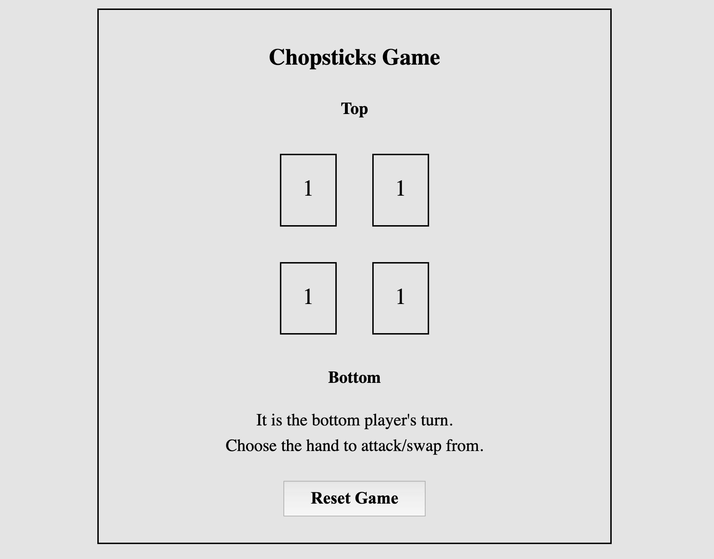

# Chopstick Game

A simple website where two users can play each other in chopsticks. Made with HTML/CSS and vanilla javascript.

## Rules

There are two sides (top & bottom) containing two hands each. One user will control each side with the objective of bringing both of the other user's hands to 0 points.

Each hand will start out with one point, and each turn a user has the option of either exchanging points between their own hands or attacking one of the other user's hands.
